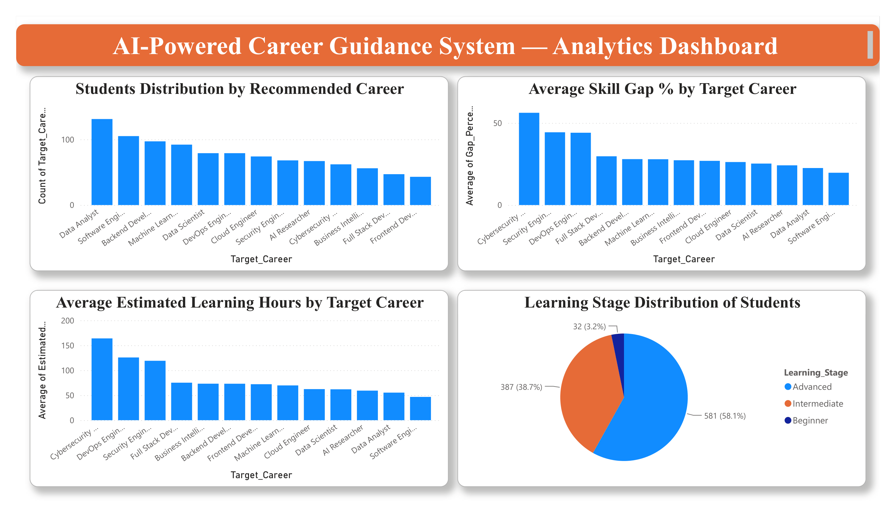
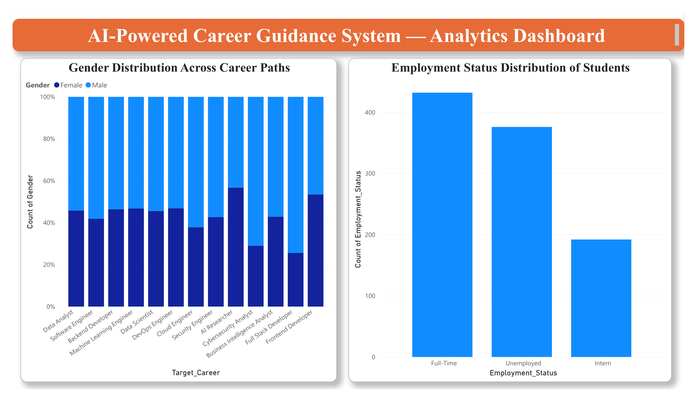
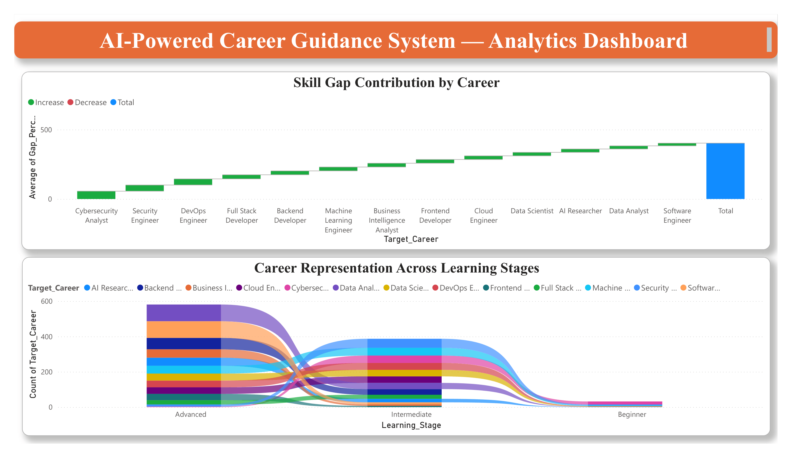
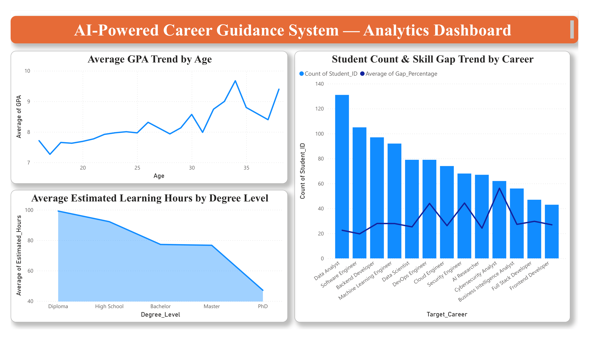

# Final Report: Draft Section 12 (Supplementary Power BI Visualization)

> Status: Draft for review. This is a supplementary, optional section (per the
> mentor's suggestion), built from the CSV datasets in `data/`. Adapted from
> the original Power BI report for consistency with the rest of the document
> (em-dashes removed, phrasing lightly adjusted); the technical content,
> methodology, and insights are unchanged.

---

## 12. Supplementary Power BI Visualization

### 12.1 Introduction

The core AI-Powered Career Guidance System is built using Python, Scikit-Learn, XGBoost, and Streamlit. As a supplementary addition, a Power BI dashboard was developed to present the underlying dataset in an interactive, business-intelligence format, translating the prediction and recommendation data into decision-ready visual insights covering career distribution, skill gap analysis, learning readiness, and demographic patterns.

### 12.2 Objectives

- Visualize the distribution of students across recommended career paths.
- Identify which careers carry the highest average skill gap and estimated learning effort.
- Assess student readiness levels (Beginner, Intermediate, Advanced) across the learning pipeline.
- Explore demographic patterns (gender distribution) and employment status across the student dataset.
- Present trend-based insights, such as the relationship between age and academic performance (GPA).

### 12.3 Data Sources

The dashboard was built using three of the project's existing datasets (`data/`), each connected to Power BI via the Text/CSV connector: `career_prediction.csv`, `career_skill_gap.csv`, and `career_learning_path.csv`. All three share a common `Student_ID` field (1,000 synthetic student profiles in each file, consistent with the structure documented in `data/README.md` and Section 9.4), which allowed Power BI to relate the tables and support cross-dataset visuals such as the combination chart on the Trend Analysis page. Data quality checks performed before import confirmed no missing or null values across any of the three files.

### 12.4 Methodology

The dashboard was developed in Power BI Desktop using the following workflow:

- **Data import:** each CSV file was imported individually using Get Data → Text/CSV.
- **Data modelling:** a calculated column (`Stage_Order`) was added via Power Query to enforce a logical sort order (Beginner → Intermediate → Advanced) for the `Learning_Stage` field.
- **Visualization:** charts were built using Power BI's native visual types, chosen to match the analytical purpose of each metric: Clustered Column, 100% Stacked Column, Pie, Waterfall, Ribbon, Line and Stacked Column (Combo), Line, and Area charts.
- **Aggregation:** measures were configured using Count and Average summarizations depending on the metric (for example, student counts versus average skill gap percentage).
- **Layout:** visuals were organized into a four-page report with a consistent header banner, using a 2x2 grid layout on overview pages.
- **Export:** the final dashboard was exported to PDF for inclusion in project documentation and demonstration purposes.

### 12.5 Dashboard Structure

The report consists of four pages, each focused on a specific analytical theme.

**Page 1: Overview.** Four core metrics in a 2x2 grid: students recommended per career, average skill gap percentage by career, average estimated learning hours per career, and the overall distribution of students across learning readiness stages.

*Figure 1. Overview page: career distribution, skill gap, learning hours, and readiness stage.*

Data Analyst, Software Engineer, and Backend Developer are the most frequently recommended careers, while Cybersecurity Analyst and Security Engineer show the highest average skill gaps (56.2% and 44.3% respectively), indicating these paths require the most targeted upskilling. 58.1% of students are at the Beginner readiness stage, highlighting the need for structured foundational training.

**Page 2: Demographics and Readiness.** Gender-wise distribution of students across all thirteen recommended career paths, shown using a 100% stacked column chart for proportional comparison regardless of each career's total student count.

*Figure 2. Gender distribution across career paths and employment status breakdown.*

Gender distribution varies noticeably across career categories, with some technical roles showing a higher proportion of male students and others a more balanced or female-leaning split. Employment status shows most students fall under "Full-Time" and "Unemployed," with a smaller proportion in internships.

**Page 3: Advanced Insights.** Two more complex visual types add analytical depth: a waterfall chart showing the cumulative contribution of each career to the overall average skill gap, and a ribbon chart tracking how career representation shifts across the three learning stages.

*Figure 3. Waterfall chart of cumulative skill gap and ribbon chart of career flow across learning stages.*

The waterfall chart ranks careers from lowest to highest skill-gap contribution, reinforcing that Cybersecurity Analyst, Security Engineer, and DevOps Engineer require the most preparation. The ribbon chart shows how the mix of careers shifts as students progress from Beginner to Advanced, with certain careers becoming more prominent at higher readiness levels.

**Page 4: Trend Analysis.** A line chart tracking average GPA against student age, a combination chart overlaying student count (columns) with average skill gap percentage (line) by career, and an area chart showing average estimated learning hours by degree level.

*Figure 4. GPA trend by age, combined student-count/skill-gap view, and learning hours by degree level.*

Average GPA trends upward with increasing age, suggesting more experienced or older students in the dataset tend to hold higher academic scores. Students with lower formal qualifications (Diploma, High School) are estimated to require more learning hours on average than those with a Master's or PhD, consistent with the expectation that higher prior education reduces the residual skill gap.

### 12.6 Key Insights Summary

- Data Analyst, Software Engineer, and Backend Developer are the most commonly recommended careers in the dataset.
- Cybersecurity Analyst, Security Engineer, and DevOps Engineer present the largest skill gaps and require the greatest learning investment.
- Over half of all students (58.1%) are at the Beginner readiness stage, indicating a strong need for foundational skill-building resources.
- Gender distribution varies by career path, suggesting scope for targeted outreach in underrepresented categories.
- Academic performance (GPA) trends upward with age, while estimated learning effort trends downward with higher degree levels.

### 12.7 Tools and Techniques Used

| Category | Details |
|---|---|
| Tool | Microsoft Power BI Desktop |
| Data Source | CSV files (Text/CSV connector) |
| Data Transformation | Power Query Editor (custom column, sort-by-column) |
| Chart Types | Clustered Column, 100% Stacked Column, Pie, Waterfall, Ribbon, Combo (Line & Stacked Column), Line, Area |
| Output Format | Interactive .pbix file and exported PDF report |

### 12.8 Conclusion

The Power BI dashboard translates the project's underlying dataset into a clear, multi-page visual report. Combining foundational charts with more advanced visual types such as waterfall and ribbon charts, it offers both a high-level overview and deeper analytical insight into career recommendations, skill gaps, and student readiness, complementing the core machine learning system with a business-intelligence-oriented perspective.
